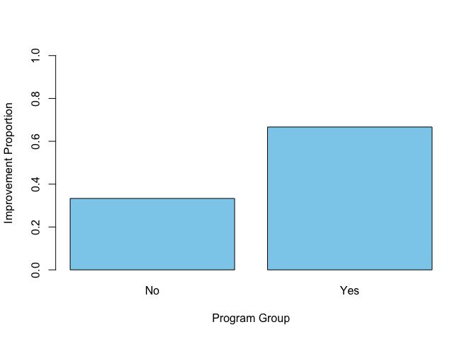

p8130_homework1
================
Lauren Holley
2026-09-28

``` r
library(tidyverse)
```

    ## ── Attaching core tidyverse packages ──────────────────────── tidyverse 2.0.0 ──
    ## ✔ dplyr     1.2.1     ✔ readr     2.2.0
    ## ✔ forcats   1.0.1     ✔ stringr   1.6.0
    ## ✔ ggplot2   4.0.3     ✔ tibble    3.3.1
    ## ✔ lubridate 1.9.5     ✔ tidyr     1.3.2
    ## ✔ purrr     1.2.2     
    ## ── Conflicts ────────────────────────────────────────── tidyverse_conflicts() ──
    ## ✖ dplyr::filter() masks stats::filter()
    ## ✖ dplyr::lag()    masks stats::lag()
    ## ℹ Use the conflicted package (<http://conflicted.r-lib.org/>) to force all conflicts to become errors

## Question 8

#### Part A

``` r
d = read.csv("homework1_clinic.csv",
             colClasses = c(id = "character"))

with(d, table(program, improved))
```

    ##        improved
    ## program 0 1
    ##     No  4 2
    ##     Yes 2 4

``` r
d |>
  group_by(program) |>
  summarise(
    total = n(),
    observed_improved = sum(!is.na(improved)),
    number_improved = sum(improved, na.rm = TRUE),
    improvement_proportion = mean(improved, na.rm = TRUE),
    missing_waits = sum(is.na(wait_min))
  )
```

    ## # A tibble: 2 × 6
    ##   program total observed_improved number_improved improvement_proportion
    ##   <chr>   <int>             <int>           <int>                  <dbl>
    ## 1 No          6                 6               2                  0.333
    ## 2 Yes         6                 6               4                  0.667
    ## # ℹ 1 more variable: missing_waits <int>

#### Part B

``` r
rate = tapply(d$improved,
               d$program, mean)

rate
```

    ##        No       Yes 
    ## 0.3333333 0.6666667

``` r
rate["Yes"] - rate["No"]
```

    ##       Yes 
    ## 0.3333333

The Yes minus No difference in improvement proportions is 0.3333 or
33.33 percentage points.

#### Part C

``` r
barplot(rate, col = "#8DCFEC",
        ylim = c(0, 1),
        xlab = "Program Group",
        ylab = "Improvement Proportion")
```

<!-- -->

#### Part D
