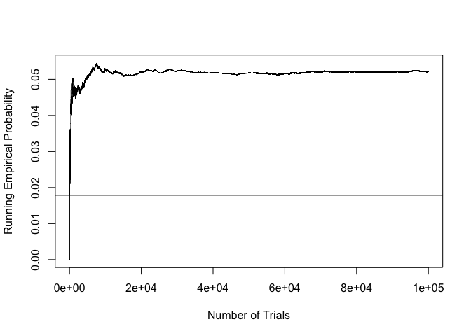

p8130_homework1
================
Lauren Holley
2026-09-28

``` r
library(tidyverse)
```

## Question 8

#### Part A

``` r
d = read.csv("homework1_clinic.csv",
             colClasses = c(id = "character"))

with(d, table(program, improved))
```

    ##        improved
    ## program 0 1
    ##     No  4 2
    ##     Yes 2 4

``` r
d |>
  group_by(program) |>
  summarise(
    total = n(),
    observed_improved = sum(!is.na(improved)),
    number_improved = sum(improved, na.rm = TRUE),
    improvement_proportion = mean(improved, na.rm = TRUE),
    missing_waits = sum(is.na(wait_min))
  )
```

    ## # A tibble: 2 × 6
    ##   program total observed_improved number_improved improvement_proportion
    ##   <chr>   <int>             <int>           <int>                  <dbl>
    ## 1 No          6                 6               2                  0.333
    ## 2 Yes         6                 6               4                  0.667
    ## # ℹ 1 more variable: missing_waits <int>

#### Part B

``` r
rate = tapply(d$improved,
               d$program, mean)

rate
```

    ##        No       Yes 
    ## 0.3333333 0.6666667

``` r
rate["Yes"] - rate["No"]
```

    ##       Yes 
    ## 0.3333333

The Yes minus No difference in improvement proportions is 0.3333 or
33.33 percentage points.

#### Part C

``` r
barplot(rate, col = "#8DCFEC",
        ylim = c(0, 1),
        xlab = "Program Group",
        ylab = "Improvement Proportion")
```

<!-- -->

#### Part D

Those in the program group had a higher improvement proportion, however
the difference found is not automatically causal because program
enrollment was voluntary. One possible confounder is that participants
who are experiencing more severe symptoms could be more likely to seek
program enrollment, impacting baseline measurements. Furthermore, if
they begin the program with more severe symptoms, this would impact
further down the line improvement levels.

## Question 10

#### Part A

Without replacement:

P(all 3 allergy) = (3/8)(2/7)(1/6) = 0.0179

With replacement:

P(all 3 allergy) = (3/8)(3/8)(3/8) = 0.0527

#### Part B

Without replacement:

``` r
set.seed(813110)
B = 100000

draws = replicate(B,
  sample.int(8, 3, replace = FALSE))

all3 = colSums(draws <= 3) == 3

c(theory = (3/8)*(2/7)*(1/6),
  empirical = mean(all3))
```

    ##     theory  empirical 
    ## 0.01785714 0.01792000

``` r
sum(all3)
```

    ## [1] 1792

With replacement:

``` r
set.seed(813111)

draws = replicate(B,
  sample.int(8, 3, replace = TRUE))

all3 = colSums(draws <= 3) == 3

c(theory = (3/8)*(3/8)*(3/8),
  empirical = mean(all3))
```

    ##     theory  empirical 
    ## 0.05273438 0.05213000

``` r
sum(all3)
```

    ## [1] 5213

Without replacement:

- Successes: 1,792

- Empirical probability: 0.0179

- Theoretical probability: 0.0179

With replacement:

- Successes: 5,213

- Empirical probability: 0.0521

- Theoretical probability: 0.0527

#### Part C

``` r
running = cumsum(all3)/seq_len(B)

running[c(100, 1000, 10000, 100000)]
```

    ## [1] 0.03000 0.04600 0.05270 0.05213

``` r
plot(seq_len(B), running,
     type = "l",
     xlab = "Number of Trials",
     ylab = "Running Empirical Probability")

abline(h = 1/56)
```

<!-- -->

#### Part 4

When there is no replacement, the probability changes as people with the
allergy are selected, whereas with replacement this does not occur. The
law of large numbers does not guarantee exact agreement after 25 trials,
as there can always be variation. However an increase in trials does
lead to running probability closer to the expected.
